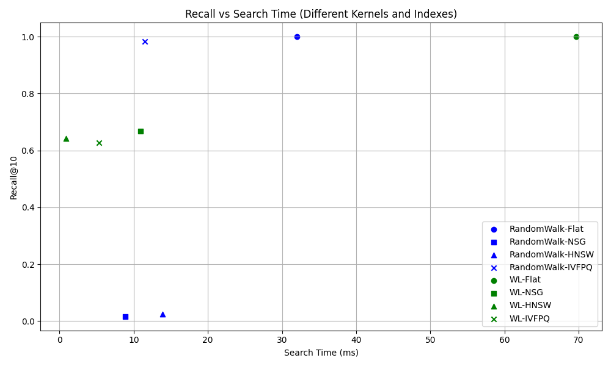

# Graph Similarity Search Experiment

This experiment aims to evaluate the performance of different graph kernel and index combinations in the task of graph similarity search. We will use the `ogbn-arxiv` dataset, sample subgraphs, apply various graph kernels to generate embeddings, construct search indexes using different indexing methods, and assess search time, recall and peak memory.

## Experiment Environment

- Python 3.x
- PyTorch
- NetworkX
- NumPy
- Matplotlib
- Grakel
- Faiss
- scikit-learn

## Experiment Steps
- Load Dataset: Load the ogbn-arxiv dataset and convert it into NetworkX graph format.
- Sample Subgraphs: Sample a specified number of subgraphs from the graph, each of size subgraph_size.
- Graph Kernel Embedding: Apply different graph kernels (e.g., Random Walk and Weisfeiler-Lehman) to the sampled subgraphs to generate embeddings.
- Build Index: Construct search indexes using different indexing methods (e.g., Flat, NSG, HNSW, IVFPQ).
- Search and Evaluation: Perform searches on the indexes and evaluate recall and search time.
Running the Experiment

## Run
- To run the experiment, ensure you have set up the correct Python environment, then execute the following command in the terminal:
```bash
python plot_ogb_arxiv_*.py
```

## Experiment Results
The experiment results will generate a plot showing search time and recall for different graph kernel and index combinations. Additionally, more details can be checked in src directory.

